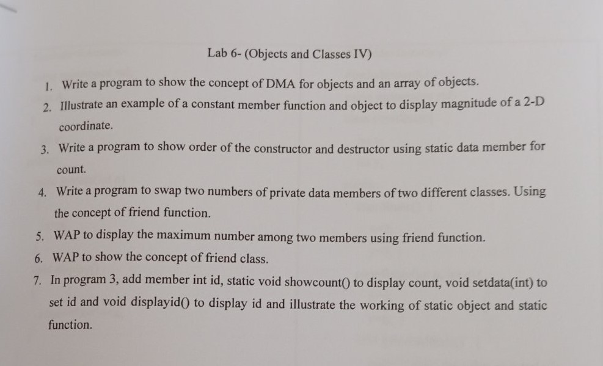

### Object and Class IV 
## Post Date : 2081-03-28

## Question 
### Lab 6- (Objects and Classes IV)
1. Write a program to show the concept of DMA for objects and an array of objects.
2. Illustrate an example of a constant member function and object to display magnitude of a 2-D coordinate.
3. Write a program to show order of the constructor and destructor using static data member for
count.
4. Write a program to swap two numbers of private data members of two different classes. Using the concept of friend function.
5. WAP to display the maximum number among two members using friend function.
6. WAP to show the concept of friend class.
7. In program 3, add member int id, static void showcount() to display count, void setdata(int) to
set id and void displayid() to display id and illustrate the working of static object and static function.

    </img>
