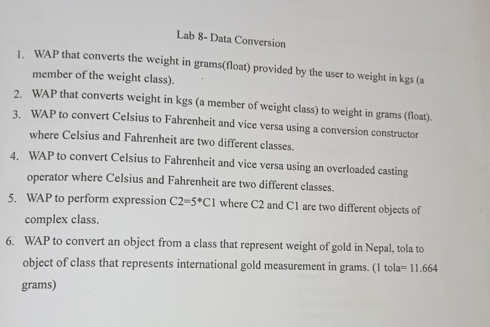

# Lab 8 On Data Conversion 
### Lab Date: 2081-04-11

1. WAP that converts the weight in grams(float) provided by the user to weight in kgs (a member of the weight class).
2. WAP that converts weight in kgs (a member of weight class) to weight in grams (float). 3. WAP to convert Celsius to Fahrenheit and vice versa using a conversion constructor where Celsius and Fahrenheit are two different classes.
4. WAP to convert Celsius to Fahrenheit and vice versa using an overloaded casting operator where Celsius and Fahrenheit are two different classes.
5. WAP to perform expression C2=5*C1 where C2 and C1 are two different objects of complex class.
6. WAP to convert an object from a class that represent weight of gold in Nepal, tola to object of class that represents international gold measurement in grams. (1 tola= 11.664 grams)

    </img>